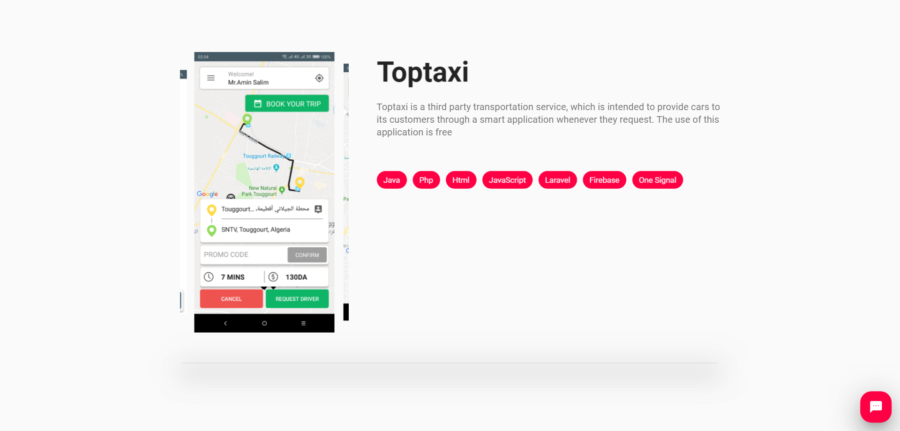
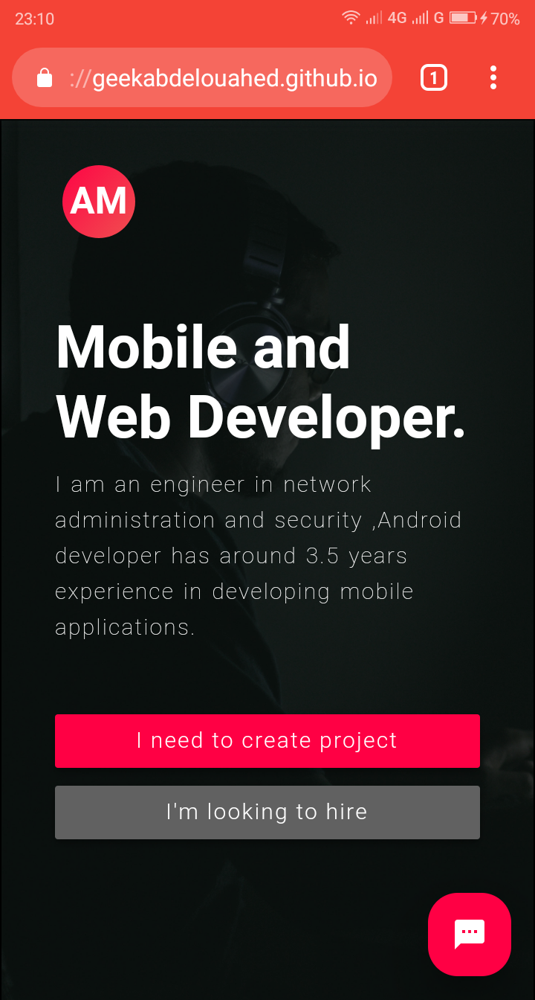
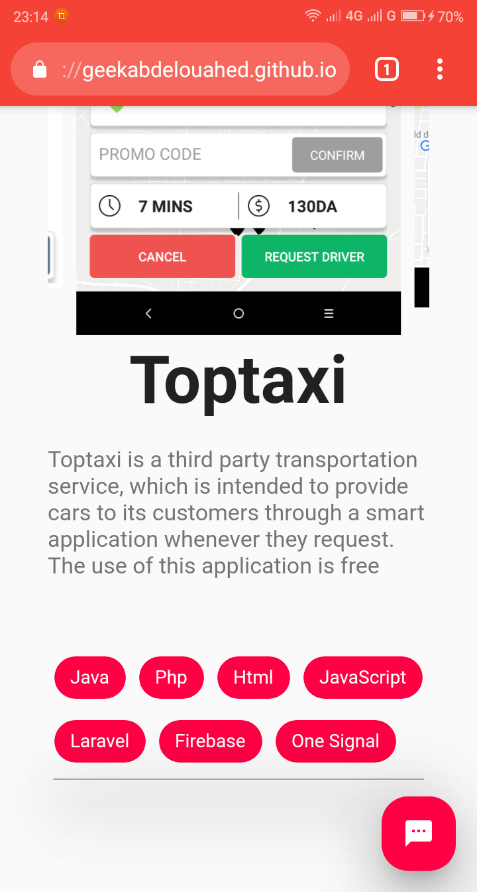

## Flutter Portfolio

Demo : https://geekabdelouahed.github.io/Flutter-Portfolio/#/

<kbd></kbd>
<kbd></kbd>
<kbd></kbd>
<kbd></kbd>

## License
  

Flutter Portfolio is Free Software: You can use, study share and improve it at your
will. Specifically you can redistribute and/or modify it under the terms of the
[GNU General Public License](https://www.gnu.org/licenses/gpl.html) as
published by the Free Software Foundation, either version 3 of the License, or
(at your option) any later version.  